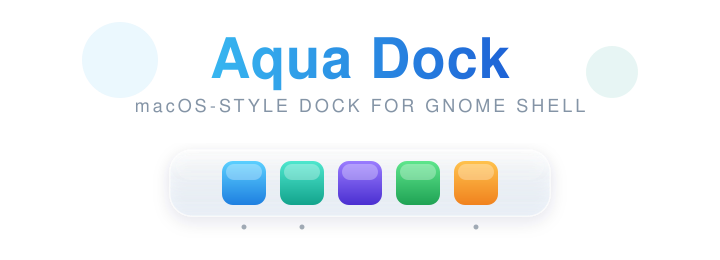

<p align="center">
  
</p>

<p align="center">
  A floating, macOS-style dock for <b>GNOME Shell</b> — Ubuntu 24.04 LTS, GNOME 46.
</p> 

---

Fixed or auto-hiding, with live customisation for transparency, icon size,
spacing, corner radius and screen position.   
  
> Built as a GNOME Shell extension rather than a standalone app on purpose:
> on Wayland (Ubuntu 24.04's default) a normal application window cannot make
> itself an always-on-top dock, reserve screen space, or auto-hide. Running 
> inside the shell is the only way to do this reliably — and it works on Xorg too.
 
## Features

- **Floating panel** anchored to the bottom, left or right edge 
- **Fixed or auto-hide** — auto-hide slides the dock away and reveals it when
  the pointer touches the screen edge
- **macOS touches** — hover magnification, running-app indicator dots, tooltips
- **Pinned + running apps** — shows your GNOME favourites plus anything running
- **Live customisation** via the preferences window, with a **built-in live
  preview** so you can see every change as you make it:
  - Icon size, icon spacing, inner padding
  - Background opacity, corner radius, dark/light panel 
  - Edge margin and position 

## Requirements

- GNOME Shell 45 / 46 / 47
- Ubuntu 24.04 LTS ships GNOME 46 ✓

## Install

```bash
./install.sh
```

Then, because GNOME on Wayland only loads new extensions on login:

```bash
# log out and back in first, then:
gnome-extensions enable aqua-dock@aedgecombe.github.io
```

On an Xorg session you can instead reload the shell with `Alt+F2` → `r` → `Enter`.

## Configure

The quickest way: **right-click anywhere on the dock** and choose
**Aqua Dock Settings…**. The right-click menu also has a quick **Auto-hide**
toggle.

You can also open the preferences from the **Extensions** app (click the gear
icon next to Aqua Dock), or from a terminal:

```bash
gnome-extensions prefs aqua-dock@aedgecombe.github.io
```

The settings window shows a **live preview** of the dock, and every change
applies to the real dock immediately — no reload needed.

## Uninstall

```bash
gnome-extensions disable aqua-dock@aedgecombe.github.io
rm -rf ~/.local/share/gnome-shell/extensions/aqua-dock@aedgecombe.github.io
```

## Development notes

- `extension.js` — the dock: builds the panel, handles placement, auto-hide,
  hover zoom, tooltips and app activation.
- `prefs.js` — libadwaita preferences window bound to GSettings.
- `schemas/` — the GSettings schema (compiled by `install.sh`).
- Watch the shell logs while iterating:
  ```bash
  journalctl -f -o cat /usr/bin/gnome-shell
  ```

## License

MIT — see [LICENSE](LICENSE).
